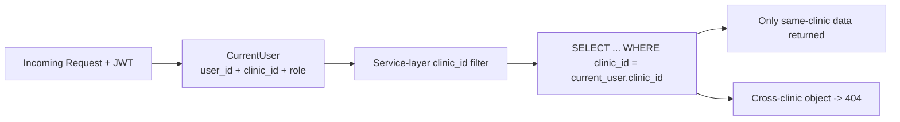
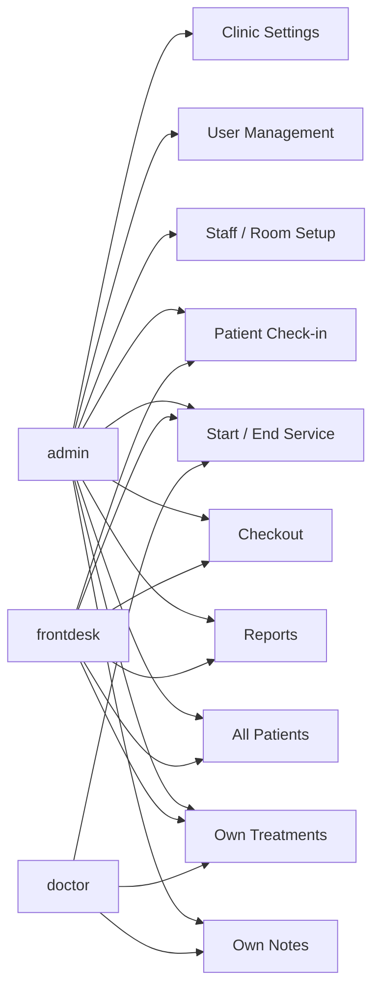
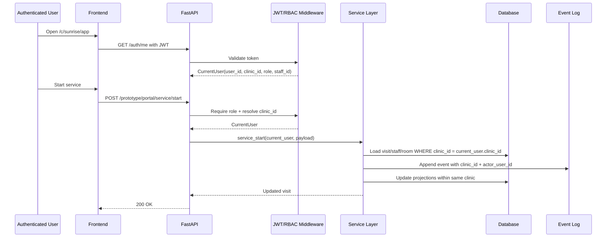

# RFC-001: Auth, RBAC, and Multi-Tenant Architecture

**Status:** Draft  
**Date:** 2026-04-02  
**Owner:** Architecture / Future implementation reference  
**Related Features:** `AUTH-00` to `AUTH-06`, `MT-01` to `MT-05` in `tasks/features.json`

---

## 1. Summary

This RFC defines the future architecture for:

- user accounts
- JWT authentication
- role-based access control
- clinic-scoped multi-tenant data isolation
- clinic provisioning and clinic-scoped routing

Current ClinicOS is still effectively a single-clinic, trust-the-client prototype. This RFC defines the target design for turning it into a safe multi-user, multi-tenant system without breaking the current domain model.

---

## 2. Current State Review

### What exists today

- Staff records exist, but they are not login accounts.
- Most write APIs accept `actor_id` from the client or hardcode `"admin"`.
- There is no `users` table.
- There is no `clinics` table.
- There is no `clinic_id` on core domain tables.
- There are no `/auth/*` routes.
- There is no RBAC middleware.

### Key risks in current state

1. User identity is not authenticated.
2. Authorization is not enforced at API or service level.
3. All data is implicitly in one global tenant.
4. A missed future tenant filter would create cross-clinic leakage.
5. Existing audit fields use actor labels, not verified user identities.

---

## 3. Goals

- Support multiple clinics in one deployment.
- Support multiple named users per clinic.
- Enforce tenant isolation by default.
- Enforce role permissions consistently across API and UI.
- Preserve compatibility with the existing visit / room / treatment domain.
- Keep migration path simple from current single-clinic prototype.

## 4. Non-Goals

- Fine-grained field-level permissions in v1
- SSO / SAML
- Cross-clinic shared users
- Multi-region data partitioning
- Full database-row security policy design beyond application-layer enforcement in the first implementation

---

## 5. Design Principles

1. Every clinic-owned record must carry `clinic_id`.
2. Every authenticated request must resolve to exactly one `user_id` and one `clinic_id`.
3. API handlers must never trust `actor_id` from request payload.
4. Cross-tenant access should return `404`, not `403`, for object lookups.
5. RBAC must be enforced in backend dependencies first; UI hiding is secondary.
6. Existing prototype tables should be extended, not replaced, where possible.

---

## 5.1 System Architecture Diagram

```mermaid
flowchart TB
    U1[Admin User]
    U2[Frontdesk User]
    U3[Doctor User]

    Browser[Web App]
    Router[Clinic-scoped Routing\n/c/{slug}]
    Auth[Auth Layer\n/auth/register /auth/login /auth/me]
    RBAC[RBAC + CurrentUser Middleware]
    API[FastAPI API Layer]
    Services[Service Layer\nclinic_id-scoped business logic]
    Events[Event Log\nclinic_id + actor_user_id]
    DB[(Postgres / Supabase)]

    Clinics[clinics]
    Users[users]
    Staff[staff]
    Patients[patients]
    Visits[visits]
    Treatments[visit_treatments]
    Insurance[insurance_policies]
    Docs[documents]
    Tasks[tasks]
    Reports[daily_reports]

    U1 --> Browser
    U2 --> Browser
    U3 --> Browser

    Browser --> Router
    Router --> Auth
    Auth --> Users
    Auth --> Clinics
    Auth --> RBAC

    Browser --> API
    API --> RBAC
    RBAC --> Services

    Services --> Events
    Services --> Clinics
    Services --> Users
    Services --> Staff
    Services --> Patients
    Services --> Visits
    Services --> Treatments
    Services --> Insurance
    Services --> Docs
    Services --> Tasks
    Services --> Reports

    Events --> DB
    Clinics --> DB
    Users --> DB
    Staff --> DB
    Patients --> DB
    Visits --> DB
    Treatments --> DB
    Insurance --> DB
    Docs --> DB
    Tasks --> DB
    Reports --> DB
```

## 5.2 Tenant Isolation Diagram



---

## 6. Data Model

### 6.1 New tables

#### `clinics`

```sql
CREATE TABLE clinics (
    clinic_id      UUID PRIMARY KEY,
    name           VARCHAR(200) NOT NULL,
    slug           VARCHAR(100) NOT NULL UNIQUE,
    timezone       VARCHAR(64) NOT NULL DEFAULT 'America/New_York',
    logo_file_ref  TEXT,
    is_active      BOOLEAN NOT NULL DEFAULT TRUE,
    created_at     TIMESTAMPTZ NOT NULL DEFAULT NOW(),
    updated_at     TIMESTAMPTZ NOT NULL DEFAULT NOW()
);
```

#### `users`

```sql
CREATE TABLE users (
    user_id           UUID PRIMARY KEY,
    clinic_id         UUID NOT NULL REFERENCES clinics(clinic_id),
    email             VARCHAR(255) NOT NULL,
    password_hash     TEXT NOT NULL,
    full_name         VARCHAR(200) NOT NULL,
    role              VARCHAR(32) NOT NULL,
    staff_id          UUID NULL,
    is_active         BOOLEAN NOT NULL DEFAULT TRUE,
    last_login_at     TIMESTAMPTZ,
    created_at        TIMESTAMPTZ NOT NULL DEFAULT NOW(),
    updated_at        TIMESTAMPTZ NOT NULL DEFAULT NOW(),
    UNIQUE (clinic_id, email)
);
```

### 6.2 Add `clinic_id` to clinic-owned tables

Add `clinic_id` to:

- `staff`
- `rooms`
- `patients`
- `appointments`
- `visits`
- `visit_treatments`
- `clinical_notes`
- `insurance_policies`
- `documents`
- `tasks`
- `daily_reports`
- `event_log`

### 6.3 Unique/index changes

- Change global `mrn` uniqueness to tenant-scoped uniqueness: `UNIQUE (clinic_id, mrn)`
- Add indexes on `(clinic_id, created_at)` or `(clinic_id, foreign_key)` where query-heavy
- Add index on `users (clinic_id, email)`
- Add index on `event_log (clinic_id, occurred_at)`

### 6.4 Staff/User linking

Use optional `users.staff_id -> staff.staff_id`.

Reason:
- doctors and therapists can resolve to treatment ownership
- front desk users do not require a staff record
- avoids forcing all users into the staff domain

---

## 7. Role Model

Initial roles:

- `admin`
- `frontdesk`
- `doctor`

### 7.1 Role semantics

- `admin`
  Full clinic access, user management, clinic settings, staff/room setup
- `frontdesk`
  Check-in, room board operations, checkout, patient records, reports
- `doctor`
  Read-only ops board, own treatments, own patient notes, limited patient context needed for care

### 7.2 RBAC matrix

| Capability | admin | frontdesk | doctor |
|---|---|---|---|
| Manage clinic settings | yes | no | no |
| Manage users | yes | no | no |
| Manage staff/rooms | yes | no | no |
| Check in patients | yes | yes | no |
| Start/end service | yes | yes | limited if linked to own staff record |
| Checkout | yes | yes | no |
| View reports | yes | yes | limited / no financial detail by default |
| View all patients | yes | yes | limited to care context |
| View own treatments | yes | yes | yes |
| Edit own notes | yes | no | yes |

Open business questions remain around exact doctor permissions; this RFC defines the default technical shape, not final clinic policy.

### 7.3 RBAC Permission Diagram



---

## 8. Authentication Model

### 8.1 Login

`POST /auth/login`

Request:

```json
{
  "email": "user@example.com",
  "password": "secret"
}
```

Response:

```json
{
  "access_token": "...",
  "token_type": "bearer",
  "expires_in": 28800,
  "user": {
    "user_id": "...",
    "clinic_id": "...",
    "full_name": "...",
    "role": "admin",
    "staff_id": null
  }
}
```

### 8.2 Register

`POST /auth/register`

Creates:

- clinic row
- first admin user
- JWT session

### 8.3 Me

`GET /auth/me`

Returns authenticated user context including:

- `user_id`
- `clinic_id`
- `role`
- `staff_id`
- clinic basics

### 8.4 Token claims

JWT payload should contain:

```json
{
  "sub": "<user_id>",
  "clinic_id": "<clinic_id>",
  "role": "admin",
  "staff_id": "<optional staff_id>",
  "exp": 1234567890
}
```

### 8.5 Passwords

- store bcrypt hashes only
- no plaintext or reversible encryption
- minimum password policy handled at auth layer

---

## 8.6 Auth Request Flow Diagram



---

## 9. Request Context

Every authenticated request should resolve a `CurrentUser` object:

```python
class CurrentUser:
    user_id: str
    clinic_id: str
    role: str
    staff_id: str | None
```

All protected routes should use a dependency such as:

```python
current_user: CurrentUser = Depends(require_role(...))
```

This replaces:

- hardcoded `actor_id="admin"`
- client-supplied `payload.actor_id`

For audit events:

- `actor_id` should become the authenticated `user_id`
- event payload may also include `actor_role` if helpful

---

## 10. Tenant Isolation

### 10.1 Rule

Every service-layer query that touches tenant-owned data must include `clinic_id`.

### 10.2 Service contract change

All service functions should accept `clinic_id` explicitly or derive it from `CurrentUser`.

Example:

```python
async def get_patient(db, clinic_id: str, patient_id: str) -> dict | None:
    ...
```

### 10.3 Object lookup behavior

If a user from Clinic A asks for Clinic B data:

- return `404 Not Found`
- do not reveal that the object exists

### 10.4 DB hardening

Application-layer tenant filtering is required in v1.

For Supabase production, future hardening should include one of:

- row-level security policies, or
- a dedicated backend service role layer that never exposes raw table access to browser clients

---

## 11. Clinic Routing

Preferred v1 routing:

- `/c/{slug}/login`
- `/c/{slug}/app`

Why slug routing first:

- simpler local development
- simpler Vercel deployment
- easier Playwright coverage
- easier support/debugging than subdomains

Subdomains can be added later once tenant routing is stable.

---

## 12. Provisioning Model

Two supported flows can coexist:

### 12.1 Self-serve

`POST /auth/register`

Use for SaaS onboarding.

### 12.2 Internal provisioning

`POST /superadmin/clinics`

Use for support-led setup, migrations, or enterprise onboarding.

Recommendation:

- implement self-serve first
- reserve superadmin provisioning for operational tooling

---

## 13. Migration Plan

### Phase 1: Introduce clinic identity

1. Create `clinics`
2. Create one default clinic row representing the current single-clinic deployment
3. Add nullable `clinic_id` columns to tenant-owned tables
4. Backfill all existing rows to the default clinic
5. Make `clinic_id` non-null

### Phase 2: Introduce users

1. Create `users`
2. Seed first admin user for default clinic
3. Add auth endpoints
4. Add password hashing and JWT issuance

### Phase 3: Retrofit protected routes

1. Add auth dependency
2. Remove request-body `actor_id` trust
3. Pass authenticated user context into service layer
4. Update event creation to use `current_user.user_id`

### Phase 4: Add RBAC and UI gating

1. Enforce backend permission checks
2. Hide/show tabs and buttons in UI
3. Add clinic-scoped routing

---

## 14. API Changes

### New routes

- `POST /auth/register`
- `POST /auth/login`
- `POST /auth/logout`
- `GET /auth/me`
- `GET /admin/users`
- `POST /admin/users`
- `PATCH /admin/users/{user_id}`
- `PATCH /admin/users/{user_id}/deactivate`
- `GET /admin/clinic`
- `PATCH /admin/clinic/settings`

### Route behavior changes

All existing `/prototype/*` routes that mutate data must:

- require auth
- derive actor from auth context
- scope by `clinic_id`

---

## 15. Event Model Impact

Existing event-sourcing rules still apply.

Changes:

- add `clinic_id` to `event_log`
- use authenticated `user_id` as event actor
- ensure all projections rebuild within clinic scope

Example future payload:

```json
{
  "clinic_id": "...",
  "visit_id": "...",
  "patient_id": "...",
  "room_id": "...",
  "staff_id": "...",
  "actor_user_id": "..."
}
```

---

## 16. Testing Strategy

### Unit / API

- `tests/test_auth.py`
- `tests/test_multitenant.py`

Coverage should include:

- password verification
- JWT validation
- role permissions
- clinic scoping
- cross-tenant lookup returns `404`
- staff/user linking
- registration conflicts on slug and email

### UI / E2E

- login / logout
- role-based visibility
- clinic URL routing
- user management
- clinic settings

### Regression requirements

- existing single-clinic workflows must still pass under a default clinic
- no current operations-board flow should regress during auth rollout

---

## 17. Open Questions

These remain product decisions, not blockers for the technical direction:

1. Exact doctor permissions for notes, treatments, and patient visibility
2. Whether front desk may start/end service or only assign and checkout
3. Whether one person can hold multiple roles
4. Whether network status belongs to patient, policy, or visit
5. Whether future clinic routing should stay slug-based or move to subdomains

---

## 18. Recommended Rollout Order

1. `MT-01` Tenant/clinic data model
2. `AUTH-01` User accounts and JWT authentication
3. `AUTH-02` Role model
4. `AUTH-03` RBAC API middleware
5. retrofit existing routes to authenticated user context
6. `AUTH-06` Staff-to-user linking
7. `AUTH-04` Role-based UI
8. `AUTH-05` User management admin panel
9. `AUTH-00` Clinic owner self-registration
10. `MT-04` Clinic-scoped routing
11. `MT-05` Per-clinic settings and branding

---

## 19. Decision

For future implementation, ClinicOS should adopt:

- tenant-scoped relational data with `clinic_id`
- authenticated named users with JWT
- backend-enforced RBAC
- application-layer tenant isolation on every query
- slug-based clinic routing first
- optional staff-to-user linking for clinical identity resolution

This RFC is the reference architecture for that work.
