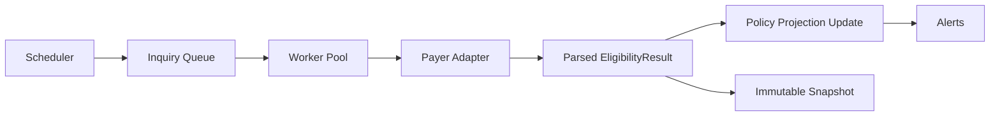

# RFC-003: Eligibility Inquiry Engine

**Status:** Draft
**Date:** 2026-04-04
**Owner:** Architecture / Insurance Ops
**Related PRD:** `docs/PRD/007-insurance-intake-eligibility-auto-inquiry.md`

---

## 1. Summary

This RFC defines the technical architecture for insurance intake expansion and payer-portal eligibility automation:

- expanded insurance data model
- payer configuration registry
- manual and automated eligibility inquiries
- immutable inquiry snapshots
- scheduler-driven re-inquiry
- pre-visit eligibility triggers
- pluggable payer adapters using headless browser automation
- inquiry dashboard and alerting support

The design extends the existing ClinicOS event-sourced, clinic-scoped architecture and keeps PHI out of event payloads.

---

## 2. Current-State Constraints

- `insurance_policies` exists but does not cover the full paper-form field set
- current eligibility handling is manual and external to ClinicOS
- app uses FastAPI + SQLAlchemy async + SQLite locally + PostgreSQL/Supabase in prod
- multi-tenancy already relies on `clinic_id`
- immutable write-side `event_log` already exists and should remain append-only
- payer inquiry is explicitly portal-scraping based, not EDI 270/271 in this phase

---

## 3. Event Schemas

### 3.1 New event types

- `PAYER_CONFIG_CREATED`
- `PAYER_CONFIG_UPDATED`
- `ELIGIBILITY_INQUIRY_REQUESTED`
- `ELIGIBILITY_INQUIRY_STARTED`
- `ELIGIBILITY_INQUIRY_COMPLETED`
- `ELIGIBILITY_INQUIRY_FAILED`
- `ELIGIBILITY_SNAPSHOT_CREATED`
- `ELIGIBILITY_ALERT_CREATED`

### 3.2 Event payloads

#### `ELIGIBILITY_INQUIRY_REQUESTED`

```json
{
  "clinic_id": "uuid",
  "inquiry_id": "uuid",
  "policy_id": "uuid",
  "patient_id": "uuid",
  "trigger_type": "manual|scheduled|pre_visit",
  "requested_by": "user_id",
  "scheduled_for": "2026-04-05T03:00:00Z"
}
```

#### `ELIGIBILITY_INQUIRY_COMPLETED`

```json
{
  "clinic_id": "uuid",
  "inquiry_id": "uuid",
  "policy_id": "uuid",
  "patient_id": "uuid",
  "status": "verified|denied|expired|partial",
  "adapter_type": "uhc|aetna|bcbs|cigna|generic",
  "snapshot_id": "uuid",
  "completed_at": "2026-04-05T03:02:00Z"
}
```

#### `ELIGIBILITY_INQUIRY_FAILED`

```json
{
  "clinic_id": "uuid",
  "inquiry_id": "uuid",
  "policy_id": "uuid",
  "patient_id": "uuid",
  "adapter_type": "generic",
  "failure_code": "portal_timeout|auth_failed|layout_changed|member_not_found",
  "retry_count": 2,
  "failed_at": "2026-04-05T03:02:00Z"
}
```

#### `ELIGIBILITY_ALERT_CREATED`

```json
{
  "clinic_id": "uuid",
  "alert_id": "uuid",
  "policy_id": "uuid",
  "patient_id": "uuid",
  "old_status": "verified",
  "new_status": "denied",
  "inquiry_id": "uuid",
  "created_at": "2026-04-05T03:02:10Z"
}
```

---

## 4. Data Model Changes

### 4.1 `insurance_policies` expansion

```sql
ALTER TABLE insurance_policies ADD COLUMN plan_code VARCHAR(64);
ALTER TABLE insurance_policies ADD COLUMN effective_date_start DATE;
ALTER TABLE insurance_policies ADD COLUMN effective_date_end DATE;
ALTER TABLE insurance_policies ADD COLUMN referral_required BOOLEAN DEFAULT FALSE;
ALTER TABLE insurance_policies ADD COLUMN preauth_required BOOLEAN DEFAULT FALSE;
ALTER TABLE insurance_policies ADD COLUMN deductible_individual NUMERIC(10,2);
ALTER TABLE insurance_policies ADD COLUMN deductible_individual_met NUMERIC(10,2);
ALTER TABLE insurance_policies ADD COLUMN deductible_family NUMERIC(10,2);
ALTER TABLE insurance_policies ADD COLUMN deductible_family_met NUMERIC(10,2);
ALTER TABLE insurance_policies ADD COLUMN oop_max_individual NUMERIC(10,2);
ALTER TABLE insurance_policies ADD COLUMN oop_met_individual NUMERIC(10,2);
ALTER TABLE insurance_policies ADD COLUMN coverage_pct NUMERIC(5,2);
ALTER TABLE insurance_policies ADD COLUMN coinsurance_pct NUMERIC(5,2);
ALTER TABLE insurance_policies ADD COLUMN checked_by_user_id VARCHAR(36);
ALTER TABLE insurance_policies ADD COLUMN medical_review_ref VARCHAR(128);
ALTER TABLE insurance_policies ADD COLUMN coverage_scope VARCHAR(64);
ALTER TABLE insurance_policies ADD COLUMN rx_bin VARCHAR(50);
ALTER TABLE insurance_policies ADD COLUMN rx_pcn VARCHAR(50);
ALTER TABLE insurance_policies ADD COLUMN rx_grp VARCHAR(50);
```

### 4.2 `payer_configs`

```sql
CREATE TABLE payer_configs (
    payer_config_id      UUID PRIMARY KEY,
    clinic_id            UUID NOT NULL,
    payer_name           VARCHAR(128) NOT NULL,
    adapter_type         VARCHAR(64) NOT NULL,
    portal_url           TEXT NOT NULL,
    login_username_enc   TEXT NOT NULL,
    login_password_enc   TEXT NOT NULL,
    login_config         JSONB,
    inquiry_config       JSONB,
    active               BOOLEAN NOT NULL DEFAULT TRUE,
    created_at           TIMESTAMPTZ NOT NULL DEFAULT NOW(),
    updated_at           TIMESTAMPTZ NOT NULL DEFAULT NOW()
);

CREATE INDEX idx_payer_configs_clinic_active
ON payer_configs (clinic_id, active);
```

### 4.3 `eligibility_inquiries`

```sql
CREATE TABLE eligibility_inquiries (
    inquiry_id           UUID PRIMARY KEY,
    clinic_id            UUID NOT NULL,
    patient_id           UUID NOT NULL,
    policy_id            UUID NOT NULL,
    payer_config_id      UUID NOT NULL,
    trigger_type         VARCHAR(32) NOT NULL,
    status               VARCHAR(32) NOT NULL,
    requested_by_user_id UUID,
    appointment_id       UUID,
    retry_count          INT NOT NULL DEFAULT 0,
    scheduled_for        TIMESTAMPTZ,
    started_at           TIMESTAMPTZ,
    completed_at         TIMESTAMPTZ,
    failure_code         VARCHAR(64),
    failure_detail       TEXT,
    created_at           TIMESTAMPTZ NOT NULL DEFAULT NOW()
);

CREATE INDEX idx_eligibility_inquiries_clinic_status
ON eligibility_inquiries (clinic_id, status, created_at DESC);
```

### 4.4 `eligibility_snapshots`

```sql
CREATE TABLE eligibility_snapshots (
    snapshot_id          UUID PRIMARY KEY,
    clinic_id            UUID NOT NULL,
    inquiry_id           UUID NOT NULL,
    patient_id           UUID NOT NULL,
    policy_id            UUID NOT NULL,
    raw_payload_enc      TEXT,
    raw_html_ref         TEXT,
    parsed_result        JSONB NOT NULL,
    payer_response_at    TIMESTAMPTZ,
    created_at           TIMESTAMPTZ NOT NULL DEFAULT NOW()
);

CREATE INDEX idx_eligibility_snapshots_policy_time
ON eligibility_snapshots (policy_id, created_at DESC);
```

### 4.5 `eligibility_alerts`

```sql
CREATE TABLE eligibility_alerts (
    alert_id             UUID PRIMARY KEY,
    clinic_id            UUID NOT NULL,
    patient_id           UUID NOT NULL,
    policy_id            UUID NOT NULL,
    inquiry_id           UUID NOT NULL,
    old_status           VARCHAR(32),
    new_status           VARCHAR(32) NOT NULL,
    acknowledged_by      UUID,
    acknowledged_at      TIMESTAMPTZ,
    created_at           TIMESTAMPTZ NOT NULL DEFAULT NOW()
);
```

---

## 5. API Contracts

### 5.1 Insurance intake

- `POST /prototype/patients/{patient_id}/insurance-policies`
- `PATCH /prototype/insurance-policies/{policy_id}`
- `GET /prototype/patients/{patient_id}/insurance-policies`

### 5.2 Payer config admin

- `GET /prototype/admin/payer-configs`
- `POST /prototype/admin/payer-configs`
- `PATCH /prototype/admin/payer-configs/{payer_config_id}`
- `POST /prototype/admin/payer-configs/{payer_config_id}/test-login`

### 5.3 Inquiry execution

- `POST /prototype/insurance-policies/{policy_id}/eligibility-inquiries`
- `GET /prototype/eligibility-inquiries/{inquiry_id}`
- `POST /prototype/eligibility-inquiries/{inquiry_id}/retry`

### 5.4 Inquiry dashboard + history

- `GET /prototype/eligibility-inquiries`
- filters:
  - `status`
  - `payer_config_id`
  - `patient_id`
  - `trigger_type`
  - date range
- `GET /prototype/patients/{patient_id}/eligibility-history`
- `GET /prototype/eligibility-snapshots/{snapshot_id}`

### 5.5 Alerts

- `GET /prototype/eligibility-alerts`
- `POST /prototype/eligibility-alerts/{alert_id}/acknowledge`

---

## 6. Scraping Engine Design

### 6.1 Components

- API layer creates inquiry requests
- worker process owns Playwright execution
- adapter registry resolves payer-specific behavior
- parser returns normalized `EligibilityResult`
- projection updater writes latest policy fields
- snapshot writer persists immutable raw + parsed results

### 6.2 Adapter interface

```python
class BaseEligibilityAdapter:
    async def login(self, page, creds, config): ...
    async def search_member(self, page, patient, policy, config): ...
    async def extract_eligibility(self, page, config) -> EligibilityResult: ...
```

### 6.3 Standardized result

```json
{
  "eligibility_status": "verified",
  "plan_type": "PPO",
  "effective_date_start": "2026-01-01",
  "effective_date_end": "2026-12-31",
  "copay_amount": 35.0,
  "coverage_pct": 80.0,
  "deductible_individual": 1000.0,
  "deductible_individual_met": 400.0,
  "visits_authorized": 40,
  "visits_used": 15,
  "rx_bin": "610020"
}
```

---

## 7. Scheduler Design

- daily scheduler scans active policies for overdue verification
- pre-visit scheduler scans future appointments inside configurable lead window
- failed jobs retry with exponential backoff
- concurrency limited per clinic and per payer adapter



---

## 8. Security Model

- payer credentials encrypted with Fernet
- decrypted only inside worker runtime
- raw payer HTML/data stored encrypted or by secure object reference
- events contain entity IDs only
- inquiry permissions limited to `frontdesk` and `admin`
- payer config CRUD limited to `admin`

---

## 9. Task Breakdown

### Backend

- `INS-BE-01` Insurance policy schema expansion + migration
- `INS-BE-02` Payer config table, encryption, and admin CRUD
- `INS-BE-03` Inquiry tables and lifecycle state machine
- `INS-BE-04` Playwright worker + adapter interface
- `INS-BE-05` Generic adapter implementation
- `INS-BE-06` Named adapters for first-wave payers
- `INS-BE-07` Snapshot persistence + encrypted raw payload handling
- `INS-BE-08` Scheduler + retry queue
- `INS-BE-09` Inquiry dashboard APIs + history APIs
- `INS-BE-10` Eligibility alert generation and acknowledgment

### Frontend

- `INS-FE-01` Enhanced insurance intake UI
- `INS-FE-02` Inquiry dashboard + patient history UI
- `INS-FE-03` Payer config admin UI

---

## 10. Testing Plan

- pytest coverage for inquiry lifecycle state changes
- adapter contract tests with mocked HTML fixtures
- encrypted credential storage tests
- scheduler tests for due-policy and pre-visit selection
- Playwright tests for insurance UI + inquiry dashboard

---

## 11. Risks

- payer portals may change without notice
- CAPTCHA or MFA may block full automation for some carriers
- raw portal output may contain sensitive PHI and must be stored carefully
- scheduler overload could trigger payer anti-bot protections

---

## 12. Decision

Proceed with payer-portal scraping as the first eligibility architecture because it matches current clinic operations and avoids clearinghouse dependency. Preserve a clean adapter boundary so EDI/clearinghouse integrations can replace or supplement this engine later.
