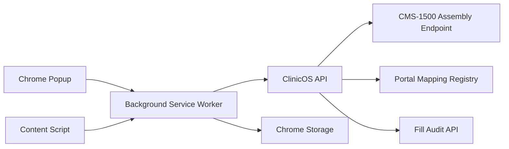
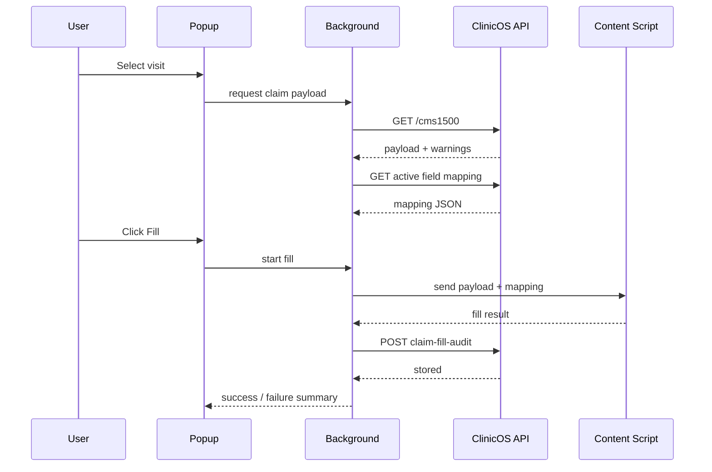

# RFC-004: Claims Auto-Fill Chrome Extension Architecture

**Status:** Draft
**Date:** 2026-04-04
**Owner:** Architecture / Billing
**Related PRD:** `docs/PRD/008-claims-autofill-chrome-extension.md`

---

## 1. Summary

This RFC defines the backend + browser-extension architecture for CMS-1500 claim autofill:

- clinic billing configuration
- structured diagnosis and procedure coding
- CMS-1500 assembly endpoint
- Manifest V3 Chrome extension shell
- extension authentication
- portal field mapping registry
- autofill execution engine
- fill audit trail

The extension remains human-in-the-loop: it fills fields and surfaces validation issues, but does not click final submit in v1.

---

## 2. Current-State Constraints

- current billing roadmap already includes claim lifecycle and remittance work
- current visit data model does not yet guarantee structured diagnosis + CPT inputs
- current frontend is a web app, not a browser extension
- auth is JWT-based and clinic-scoped
- extension must work against arbitrary payer portals via configurable field maps

---

## 3. Event Schemas

### 3.1 New event types

- `CMS1500_ASSEMBLED`
- `CLAIM_FILL_STARTED`
- `CLAIM_FILL_COMPLETED`
- `CLAIM_FILL_FAILED`

### 3.2 Event payloads

#### `CMS1500_ASSEMBLED`

```json
{
  "clinic_id": "uuid",
  "visit_id": "uuid",
  "patient_id": "uuid",
  "insurance_policy_id": "uuid",
  "assembled_by": "user_id",
  "assembly_version": "v1",
  "warning_count": 2,
  "assembled_at": "2026-04-05T12:00:00Z"
}
```

#### `CLAIM_FILL_COMPLETED`

```json
{
  "clinic_id": "uuid",
  "visit_id": "uuid",
  "patient_id": "uuid",
  "actor_user_id": "uuid",
  "portal_domain": "claims.examplepayer.com",
  "mapping_version": "2026-04-05.1",
  "filled_field_count": 29,
  "failed_field_count": 1,
  "completed_at": "2026-04-05T12:03:00Z"
}
```

#### `CLAIM_FILL_FAILED`

```json
{
  "clinic_id": "uuid",
  "visit_id": "uuid",
  "actor_user_id": "uuid",
  "portal_domain": "claims.examplepayer.com",
  "mapping_version": "2026-04-05.1",
  "failure_code": "mapping_missing|dom_changed|auth_expired|validation_blocked",
  "failed_at": "2026-04-05T12:03:00Z"
}
```

---

## 4. Data Model Changes

### 4.1 `clinic_billing_config`

```sql
CREATE TABLE clinic_billing_config (
    billing_config_id    UUID PRIMARY KEY,
    clinic_id            UUID NOT NULL UNIQUE,
    legal_name           VARCHAR(256) NOT NULL,
    billing_name         VARCHAR(256),
    tax_id               VARCHAR(32),
    billing_npi          VARCHAR(20),
    taxonomy_code        VARCHAR(32),
    billing_phone        VARCHAR(32),
    billing_address_1    VARCHAR(256),
    billing_address_2    VARCHAR(256),
    billing_city         VARCHAR(128),
    billing_state        VARCHAR(32),
    billing_zip          VARCHAR(16),
    default_pos_code     VARCHAR(8),
    payer_submitter_ids  JSONB,
    created_at           TIMESTAMPTZ NOT NULL DEFAULT NOW(),
    updated_at           TIMESTAMPTZ NOT NULL DEFAULT NOW()
);
```

### 4.2 `visit_diagnoses`

```sql
CREATE TABLE visit_diagnoses (
    visit_diagnosis_id   UUID PRIMARY KEY,
    clinic_id            UUID NOT NULL,
    visit_id             UUID NOT NULL,
    diagnosis_code       VARCHAR(16) NOT NULL,
    diagnosis_label      VARCHAR(256),
    position             INT NOT NULL,
    created_at           TIMESTAMPTZ NOT NULL DEFAULT NOW()
);

CREATE UNIQUE INDEX idx_visit_diagnoses_unique_position
ON visit_diagnoses (visit_id, position);
```

### 4.3 `visit_treatments` additions

```sql
ALTER TABLE visit_treatments ADD COLUMN procedure_code VARCHAR(16);
ALTER TABLE visit_treatments ADD COLUMN modifier_1 VARCHAR(8);
ALTER TABLE visit_treatments ADD COLUMN modifier_2 VARCHAR(8);
ALTER TABLE visit_treatments ADD COLUMN modifier_3 VARCHAR(8);
ALTER TABLE visit_treatments ADD COLUMN modifier_4 VARCHAR(8);
ALTER TABLE visit_treatments ADD COLUMN units NUMERIC(10,2);
ALTER TABLE visit_treatments ADD COLUMN line_charge NUMERIC(10,2);
ALTER TABLE visit_treatments ADD COLUMN rendering_provider_id VARCHAR(36);
```

### 4.4 `staff` additions

```sql
ALTER TABLE staff ADD COLUMN npi VARCHAR(20);
ALTER TABLE staff ADD COLUMN taxonomy_code VARCHAR(32);
ALTER TABLE staff ADD COLUMN credential_suffix VARCHAR(32);
```

### 4.5 `portal_field_mappings`

```sql
CREATE TABLE portal_field_mappings (
    mapping_id           UUID PRIMARY KEY,
    clinic_id            UUID NOT NULL,
    portal_name          VARCHAR(128) NOT NULL,
    domain_pattern       TEXT NOT NULL,
    page_pattern         TEXT,
    mapping_version      VARCHAR(64) NOT NULL,
    field_map            JSONB NOT NULL,
    active               BOOLEAN NOT NULL DEFAULT TRUE,
    created_at           TIMESTAMPTZ NOT NULL DEFAULT NOW(),
    updated_at           TIMESTAMPTZ NOT NULL DEFAULT NOW()
);
```

### 4.6 `claim_fill_audit`

```sql
CREATE TABLE claim_fill_audit (
    fill_audit_id        UUID PRIMARY KEY,
    clinic_id            UUID NOT NULL,
    visit_id             UUID NOT NULL,
    patient_id           UUID NOT NULL,
    actor_user_id        UUID NOT NULL,
    portal_domain        TEXT NOT NULL,
    mapping_version      VARCHAR(64),
    payload_version      VARCHAR(32),
    outcome              VARCHAR(32) NOT NULL,
    filled_field_count   INT NOT NULL DEFAULT 0,
    failed_field_count   INT NOT NULL DEFAULT 0,
    failure_code         VARCHAR(64),
    created_at           TIMESTAMPTZ NOT NULL DEFAULT NOW()
);
```

---

## 5. API Contracts

### 5.1 Claim data assembly

- `GET /prototype/billing/visits/{visit_id}/cms1500`
  - returns normalized claim payload + warnings
- `GET /prototype/billing/visits/{visit_id}/claim-readiness`
  - returns missing diagnosis / CPT / billing-config validation state

### 5.2 Billing config

- `GET /prototype/admin/billing-config`
- `POST /prototype/admin/billing-config`
- `PATCH /prototype/admin/billing-config`

### 5.3 Mapping registry

- `GET /prototype/admin/portal-field-mappings`
- `POST /prototype/admin/portal-field-mappings`
- `PATCH /prototype/admin/portal-field-mappings/{mapping_id}`
- `POST /prototype/admin/portal-field-mappings/{mapping_id}/validate`

### 5.4 Fill audit

- `POST /prototype/billing/claim-fill-audit`
- `GET /prototype/billing/visits/{visit_id}/claim-fill-audit`

---

## 6. Extension Architecture



### 6.1 Manifest V3 components

- popup: login, visit selector, warnings, fill controls
- background service worker: auth/session, API calls, shared state
- content script: DOM inspection, field fill, post-fill validation

### 6.2 Fill lifecycle



---

## 7. Mapping Schema

Example mapping entry:

```json
{
  "cms_box": "24D",
  "label": "Procedure Code",
  "selector": "input[name='proc_code_1']",
  "transform": "identity",
  "required": true,
  "repeat_group": "service_lines"
}
```

Supported transform types:

- `identity`
- `date_mmddyyyy`
- `concat_space`
- `uppercase`
- `currency_plain`
- `diagnosis_pointer_letters`

---

## 8. CORS / Security

- allow configured `chrome-extension://<extension-id>` origin for claim assembly endpoints
- keep portal pages untrusted; never inject bearer token into page context
- background script owns API calls; content script receives only minimal claim payload needed for fill
- audit logs store counts/status, not raw PHI values

---

## 9. Task Breakdown

### Backend

- `EXT-BE-01` Clinic billing config schema + admin API
- `EXT-BE-02` Visit diagnosis schema + validation
- `EXT-BE-03` Billing fields on visit treatments
- `EXT-BE-04` Staff billing identifiers (NPI/taxonomy)
- `EXT-BE-05` CMS-1500 assembly service + endpoint
- `EXT-BE-06` Claim readiness validation endpoint
- `EXT-BE-07` Portal mapping registry API
- `EXT-BE-08` Claim fill audit API + events

### Frontend / Extension

- `EXT-FE-01` Manifest V3 extension scaffold
- `EXT-FE-02` Popup login flow
- `EXT-FE-03` Visit search + selection UI
- `EXT-FE-04` Claim warning preview UI
- `EXT-FE-05` Background service worker data flow
- `EXT-FE-06` Content script fill engine
- `EXT-FE-07` Mapping debug/validation tools
- `EXT-FE-08` End-to-end autofill test harness

---

## 10. Testing Plan

- backend contract tests for `/cms1500`
- schema validation tests for mappings
- extension integration tests against mock CMS-1500 portal pages
- Playwright-based browser tests for DOM fill behavior
- security tests ensuring tokens never enter page DOM

---

## 11. Risks

- payer portals may not match CMS-1500 layout cleanly
- content-security-policy restrictions may limit script execution on some portals
- selector drift will require mapping maintenance
- incomplete claim data upstream will reduce autofill success

---

## 12. Decision

Proceed with a generic CMS-1500 autofill extension architecture backed by a normalized assembly API and mapping registry. Keep the extension user-driven and audit-heavy in the first release to reduce compliance and operational risk.
