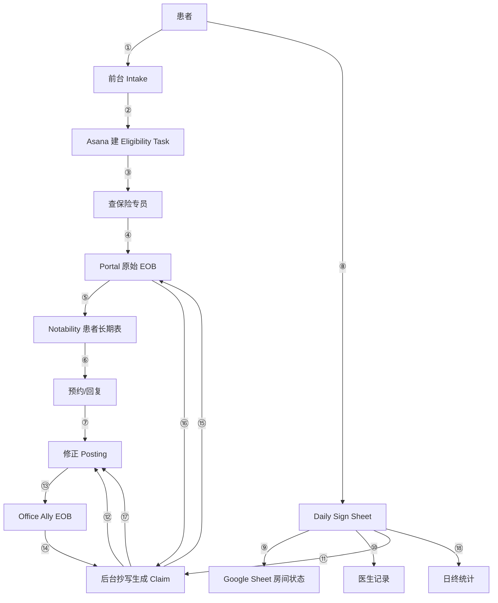

# Clinic Current-State Workflow (As-Is)

This document maps the **existing clinic workflow** — all 18 steps, with compliance risks identified at each stage. This is the ground truth that Clinic OS must replace or improve.

> **See also:**
> - `PRD/003-clinic-os-prd-v2.md` — Canonical PRD with full module scope, tool migration strategy (§7), and phased implementation plan (§14)
> - `PRD/003-clinic-os-prd-v2.md` §3 — Expanded analysis of the same tools documented here
> - `PRD/003-clinic-os-prd-v2.md` §4 — Core problems derived from this workflow

## Flow Diagram

---

## Step-by-Step Breakdown

### ① Patient Intake

**Current:** Patient fills out paper intake form.

**Data collected:**
- Full name
- Date of birth (DOB)
- Insurance information (carrier, member ID, group #)
- Signature

**Compliance:**
- ⚠️ PHI — must be encrypted at rest
- ⚠️ Must transmit over HTTPS only
- ⚠️ Cannot send via unencrypted email
- Paper forms must be stored in locked cabinet

---

### ② Front Desk Creates Eligibility Task (Asana)

**Current:** Front desk manually creates a task in Asana with patient name + insurance company.

**Compliance:**
- 🔴 **HIGH RISK:** Asana is NOT HIPAA-compliant (no BAA available)
- 🔴 Cannot store full PHI (name, DOB, insurance details)
- ⚠️ At most: patient initials + internal ID
- **Clinic OS must replace this** with an internal task system

---

### ③ Assign to Eligibility Specialist

**Current:** Manual drag-and-drop in Asana to assign task.

**Problems:**
- Fully manual — no automation
- No auto-reminders if task stalls
- No SLA tracking

**Compliance:**
- ⚠️ Should not expose full DOB on shared board

---

### ④ Login to Insurance Portal & Query

**Current:** Staff logs into insurance company portal to check:
- Eligibility status
- Visit limits (authorized visits remaining)
- Copay amount
- Deductible status

**Compliance:**
- 🔴 Login credentials must be securely managed (password manager)
- 🔴 No shared accounts — each staff needs individual credentials
- 🔴 Portal screenshots must not be stored in unencrypted locations
- ⚠️ Risk: credential leakage if passwords shared via chat/email

---

### ⑤ Record to Notability Patient Ledger

**Current:** Staff pastes portal screenshots into Notability (iPad app). Records:
- Visit count / remaining visits
- Insurance summary
- Copay/deductible notes

**Problems:**
- Non-structured data (screenshots + handwritten notes)
- No encryption
- No access control (anyone with iPad access can see all patients)
- No search capability
- Cannot generate reports

**Compliance:**
- 🔴 PHI stored on iPad locally — device must have encryption enabled
- 🔴 iCloud sync — is iCloud HIPAA-compliant? (Only with Apple BAA + Managed Apple ID)
- ⚠️ No role-based access — front desk and therapists see same data
- **Clinic OS must replace this** with structured, encrypted patient ledger

---

### ⑥ Reply to Patient / Quote

**Current:** Staff contacts patient to communicate:
- Copay amount
- Coverage explanation
- Out-of-pocket estimates

**Compliance:**
- 🔴 Cannot send PHI via unencrypted SMS
- 🔴 Cannot leave detailed diagnosis info in voicemail
- ⚠️ Email OK only if encrypted or patient has consented
- Preferred: patient portal or secure messaging

---

### ⑦ Create Appointment in PracticeMate

**Current:** Staff creates appointment in PracticeMate, links insurance.

**Compliance:**
- ✅ PracticeMate is HIPAA-compliant (BAA available)
- ✅ This step is compliant

---

### ⑧ Daily Sign Sheet — Paper Check-In

**Current:** Paper sign-in sheet tracks daily activity:
- Patient sign-in
- Service type
- Service start/end time
- Room assignment
- Payment (copay, cash, card)
- Patient signature

**Problems:**
- Paper — no encryption, no backup
- Can be photographed by anyone nearby
- Can be lost or damaged
- Manual tallying for daily reports
- No real-time visibility for staff

**Compliance:**
- 🔴 Paper PHI must be stored in locked cabinet at end of day
- 🔴 Must not be left visible in waiting area
- 🔴 Photo risk — anyone could photograph patient list
- **Clinic OS MVP must replace this** — highest priority

---

### ⑨ Google Sheet Room Status Update

**Current:** Staff updates Google Sheet with room status (which patient, which room, time).

**Problems:**
- Overwrites old data — no history
- Cannot trace who changed what
- Not real-time enough for fast clinic flow

**Compliance:**
- 🔴 **Does Google Workspace have a signed BAA?** If not, cannot store PHI
- ⚠️ Even with BAA, Google Sheets has no row-level access control
- **Clinic OS must replace this** with real-time room board

---

### ⑩ Doctor Writes EHR

**Current:** Doctor writes clinical notes, diagnosis (ICD-10), procedure codes (CPT) in EHR system.

**Compliance:**
- ✅ EHR systems are HIPAA-compliant
- ⚠️ Risk: doctor forgets to complete notes → insurance requests additional documentation → delays payment
- ⚠️ Incomplete records = audit risk

---

### ⑪ Back Office Manually Creates Claim

**Current:** Back office staff:
1. Reads paper Daily Sign Sheet
2. Looks up Notability ledger for visit count
3. Manually enters claim data into PracticeMate

**Problems:**
- High error rate (transcription from paper)
- Human judgment calls on CPT codes
- Slow — each claim is manual

**Compliance:**
- 🔴 **Billing errors can constitute fraud** (even unintentional)
- 🔴 CPT codes must be accurate — upcoding is federal offense
- 🔴 Must have audit trail for who created each claim
- **Clinic OS should automate this** — claim generation from structured events

---

### ⑫ Submit Claim

**Current:** Electronic claim submission through PracticeMate.

**Compliance:**
- ✅ Must comply with CMS billing standards
- ✅ Electronic submission is standard

---

### ⑬ Office Ally Returns EOB

**Current:** Office Ally provides simplified EOB (Explanation of Benefits).

**Problems:**
- Simplified/incomplete data
- May not match original claim exactly

**Compliance:**
- ✅ Low risk at this step

---

### ⑭ Back Office Discovers Mismatch

**Current:** Auto-post fails in PracticeMate. Back office must manually investigate.

**Problems:**
- Fully manual investigation
- No tooling to compare claim vs EOB
- Relies on experience and memory

---

### ⑮ Login to Portal for Original EOB

**Current:** Staff logs into insurance portal to view:
- Full EOB details
- Adjustment codes
- Denial reasons
- Allowed amounts

**Compliance:**
- 🔴 Portal accounts must not be shared among staff
- 🔴 Each user needs individual credentials
- ⚠️ Same credential risks as step ④

---

### ⑯ Manual Comparison

**Current:** Staff manually compares:
- Claim submitted amount vs EOB allowed amount
- Adjustment codes
- Decides whether to appeal, resubmit, or write off

**Problems:**
- Entirely experience-based — no systematic rules
- Error-prone
- Time-consuming

**Compliance:**
- 🔴 Cannot bill patient for amounts not contractually allowed
- 🔴 Cannot knowingly upcode or resubmit fraudulent claims
- **Clinic OS should automate** — dual-source EOB reconciliation

---

### ⑰ Correct Posting

**Current:** Modify payment posting in PracticeMate. May resubmit claim.

**Compliance:**
- 🔴 **All modifications must have audit trail**
- 🔴 **Original records must never be deleted** — only amended
- 🔴 Must document reason for correction

---

### ⑱ End-of-Day Summary

**Current:** Manual calculation of:
- Therapist hours worked
- Total patients seen
- Total revenue collected
- Room utilization

**Problems:**
- Manual tallying from paper sheet
- Not auditable — no trail of how numbers were derived
- Errors compound

**Compliance:**
- 🔴 Financial records must be retained 7+ years
- ⚠️ Must be reproducible for audits

---

## Critical Compliance Risk Summary

| Step | Tool | Risk Level | Issue |
|------|------|------------|-------|
| ② ③ | Asana | 🔴 HIGH | Not HIPAA-compliant, no BAA, PHI exposure |
| ⑤ | Notability | 🔴 HIGH | Unstructured PHI, no encryption, no access control |
| ⑨ | Google Sheets | 🔴 HIGH | BAA status unknown, overwrites history |
| ⑧ | Paper Sign Sheet | 🔴 HIGH | PHI exposure, no encryption, loss risk |
| ④ ⑮ | Insurance Portals | 🟡 MEDIUM | Shared credentials risk |
| ⑪ | Manual Claim Entry | 🟡 MEDIUM | Billing accuracy / fraud risk |
| ⑯ ⑰ | Manual Reconciliation | 🟡 MEDIUM | No audit trail for corrections |
| ⑥ | Patient Communication | 🟡 MEDIUM | Unencrypted channels for PHI |
| ⑦ ⑩ ⑫ | PracticeMate / EHR | ✅ LOW | HIPAA-compliant systems |

---

## Clinic OS Module Mapping (aligned with PRD v2.0 §14)

Each compliance risk maps to a Clinic OS module and implementation phase:

| Clinic OS Module | Replaces Steps | PRD v2.0 § | Phase |
|---|---|---|---|
| **Event Log System** | Foundation for all modules | §9 | Phase 1 |
| **Front Desk Operations Board** (was: Electronic Daily Sign Sheet) | ⑧ ⑨ ⑱ | §11.3 | Phase 1 |
| **Patient Master File** | Scattered records | §11.1 | Phase 1 |
| **Appointment Management** | PracticeMate partial | §11.2 | Phase 1 |
| **Visit Management** | Manual tracking | §11.5 | Phase 1 |
| **Clinical Note (basic)** | EHR notes / Notability | §11.6 | Phase 1 |
| **Document / Signature Archive** | Notability 手工归档 | §11.4 | Phase 1 |
| **Task Management (basic)** | Asana (②③) | §11.9 | Phase 1 |
| **Insurance / Eligibility** | ② ③ ④ ⑤ | §11.7 | Phase 2 |
| **Claim / Billing State Machine** | ⑪ ⑫ | §11.8 | Phase 2 |
| **Dual-Source EOB Reconciliation** | ⑬ ⑭ ⑮ ⑯ ⑰ | §11.8 | Phase 2 |
| **AI Input / Extraction** | Manual transcription | §11.6 | Phase 3 |
| **AI Agent Back-Office** | Manual case processing | §11.9 | Phase 4 |
| **Compliance Audit Log** | All steps | §11.11 | Phase 1–5 |
| **Secure Messaging** | ⑥ | — | Phase 5+ |
| **Intake Digitization** | ① | — | Phase 5+ |

---

## Architecture Mandate

Before any feature ships, the following must be in place:

1. **All data encrypted** (at rest + in transit)
2. **Role-based access control** (RBAC) — least privilege
3. **Immutable audit trail** — every change tracked, nothing deletable
4. **Automatic event logging** — not optional, not "add later"
5. **BAA signed** with every third-party SaaS that touches PHI
6. **No PHI in non-compliant tools** (Asana, Notion, Slack, etc. unless BAA)
7. **Financial records retained 7+ years**
8. **Credential management** — no shared accounts, password manager required
